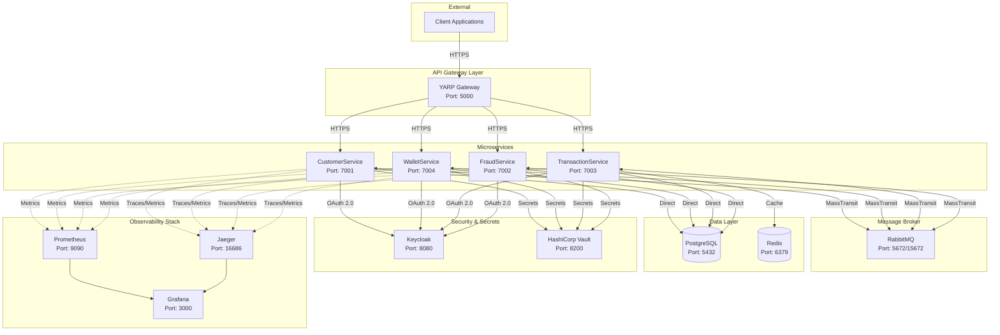
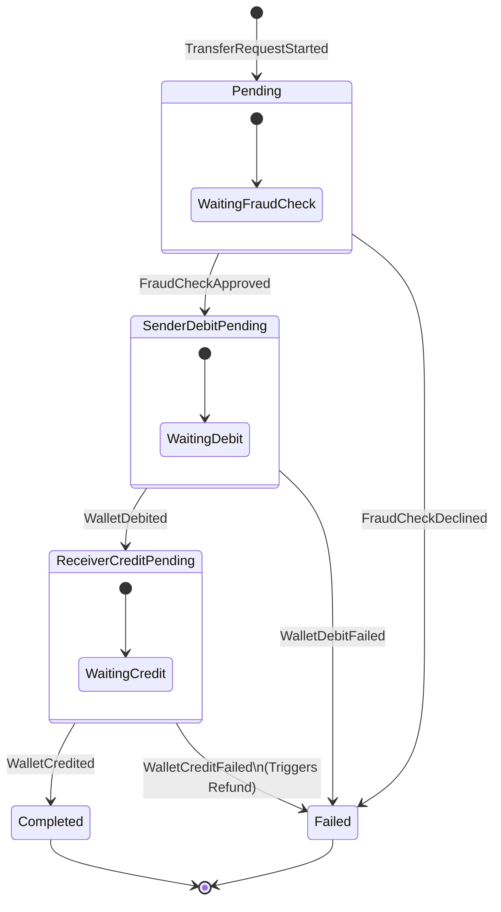
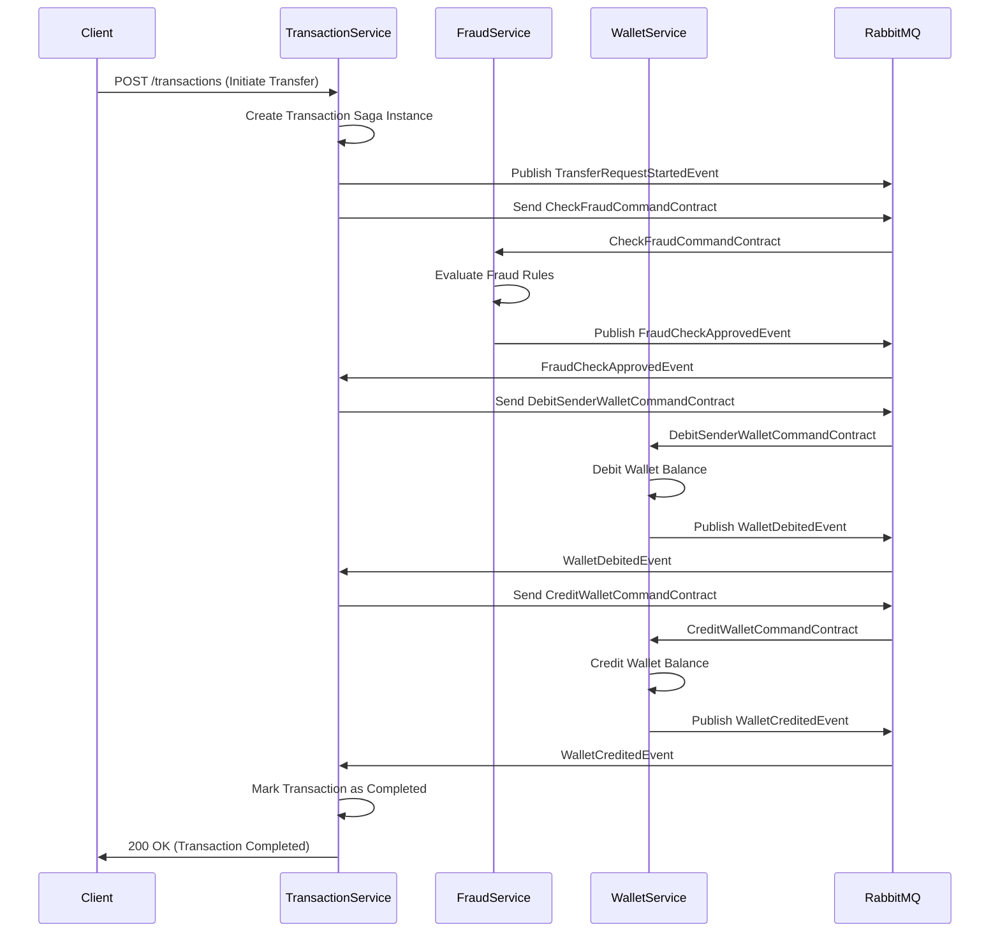
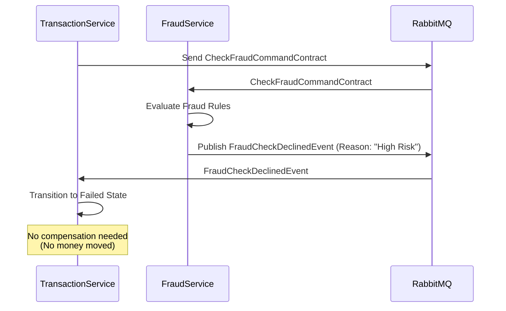
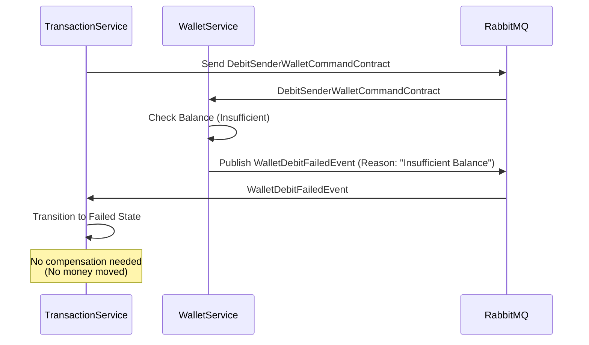
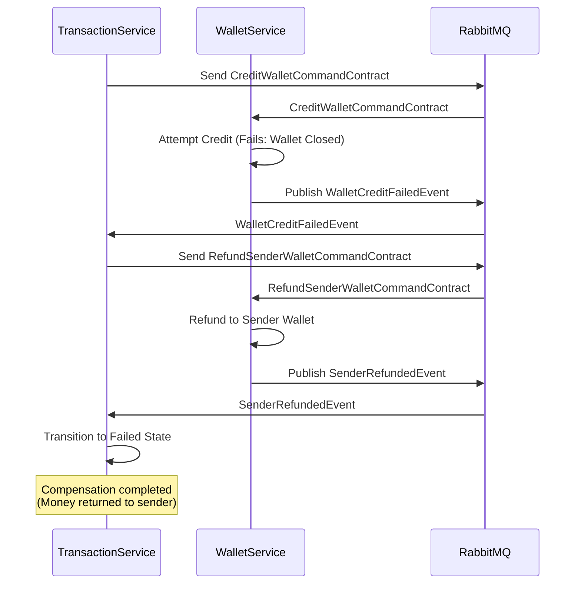

# Architecture

This document provides a comprehensive overview of the Wallet Framework architecture. It explains the "why" behind architectural decisions and provides detailed diagrams of system design.

## Table of Contents

1. [High-Level System Design](#high-level-system-design)
2. [Domain-Driven Design (DDD)](#domain-driven-design-ddd)
3. [P2P Transfer Flow (Saga State Machine)](#p2p-transfer-flow-saga-state-machine)

---

## High-Level System Design

### System Overview

Wallet Framework follows a microservices architecture pattern with clear service boundaries, event-driven communication, and database-per-service isolation. The system is designed for high scalability, resilience, and maintainability.

### Service Communication Diagram

The following diagram illustrates how services communicate within the system:

### Communication Patterns

#### Synchronous Communication

- **Client → API Gateway → Services**: All external requests flow through the YARP API Gateway
- **Service-to-Service (HTTP)**: Direct HTTP calls between services for synchronous operations (e.g., TransactionService calling CustomerService and WalletService APIs)
- **Authentication**: All service endpoints (except health checks) are protected by JWT Bearer tokens issued by Keycloak

#### Asynchronous Communication

- **Event-Driven**: Services communicate asynchronously via RabbitMQ using MassTransit
- **Integration Events**: Domain events are published as integration events to enable loose coupling
- **Commands**: Services send commands to other services through the message broker
- **Outbox Pattern**: Ensures transactional consistency when publishing events (database transaction + event publication in a single atomic operation)

#### Data Isolation

- **Database per Service**: Each microservice maintains its own PostgreSQL database
  - `WF_CustomerDb` - CustomerService
  - `WF_WalletDb` - WalletService
  - `WF_TransactionDb` - TransactionService
  - `WF_FraudDb` - FraudService
- **Shared Cache**: Redis is used for distributed caching, rate limiting, and idempotency checks

---

## Domain-Driven Design (DDD)

### Bounded Contexts

The system is organized into four distinct bounded contexts, each representing a core business domain:

| Context | Service | Primary Responsibility | Database |
|---------|---------|----------------------|----------|
| **Customer** | CustomerService | User registration, KYC status management, profile management | `WF_CustomerDb` |
| **Wallet** | WalletService | Balance management, deposit/withdraw operations, wallet lifecycle | `WF_WalletDb` |
| **Transaction** | TransactionService | P2P transfer orchestration, transaction state management (Saga) | `WF_TransactionDb` |
| **Fraud** | FraudService | Risk assessment, fraud detection rules engine, compliance checks | `WF_FraudDb` |

### Aggregate Roots

Each bounded context defines one or more aggregate roots that encapsulate business logic and maintain consistency boundaries:

#### CustomerService

**Aggregate Root**: `Customer`

- **Location**: [Customer.cs](src/Services/CustomerService/WF.CustomerService.Domain/Entities/Customer.cs)
- **Key Responsibilities**:
  - Customer lifecycle management (create, update, soft delete)
  - KYC status tracking
  - Profile information management

#### WalletService

**Aggregate Root**: `Wallet`

- **Location**: [Wallet.cs](src/Services/WalletService/WF.WalletService.Domain/Entities/Wallet.cs)
- **Key Responsibilities**:
  - Balance management (deposit, withdraw)
  - Wallet state management (active, frozen, closed)
  - Transaction history tracking

#### TransactionService

**Aggregate Root**: `Transaction` (Saga State Machine Instance)

- **Location**: [Transaction.cs](src/Services/TransactionService/WF.TransactionService.Domain/Entities/Transaction.cs)
- **Key Responsibilities**:
  - P2P transfer orchestration
  - Transaction state management
  - Failure tracking and compensation

#### FraudService

**Aggregate Roots**: Multiple Rule Entities

- **Location**: [FraudService Domain](src/Services/FraudService/WF.FraudService.Domain/Entities/)
- **Rule Types**:
  - `AccountAgeRule` - Validates account age requirements
  - `BlockedIpRule` - Manages blocked IP addresses
  - `KycLevelRule` - Enforces KYC level restrictions
  - `RiskyHourRule` - Defines risky transaction time windows
- **Key Responsibilities**:
  - Fraud rule evaluation
  - Risk scoring
  - Compliance validation

### Strategic Design Decisions

#### Context Mapping

The system uses several context mapping patterns:

1. **Shared Kernel**: `WF.Shared.Contracts` contains shared integration events, DTOs, and contracts used across all services
   - Integration events for inter-service communication
   - Command contracts for service-to-service commands
   - Common enums and value objects

2. **Anti-Corruption Layer (ACL)**: API clients act as ACLs between services
   - `ICustomerServiceApiClient` - TransactionService → CustomerService
   - `IWalletServiceApiClient` - TransactionService → WalletService
   - These clients translate between service-specific models and shared contracts

3. **Published Language**: Integration events serve as the published language for inter-service communication
   - Events are defined in `WF.Shared.Contracts.IntegrationEvents`
   - All services subscribe to relevant events via MassTransit

#### Domain Events vs Integration Events

- **Domain Events**: Internal to a service, handled within the same transaction
- **Integration Events**: Published to RabbitMQ for cross-service communication
- **Outbox Pattern**: Ensures domain events are reliably published as integration events

---

## P2P Transfer Flow (Saga State Machine)

The P2P transfer process is orchestrated using the **Saga Pattern** with MassTransit State Machine. This ensures distributed transaction consistency across multiple services.

### Saga Implementation

**Location**: [TransferSagaStateMachine.cs](src/Services/TransactionService/WF.TransactionService.Infrastructure/Features/Sagas/TransferSagaStateMachine.cs)

The saga orchestrates the following steps:
1. Fraud check validation
2. Sender wallet debit
3. Receiver wallet credit
4. Compensation (refund) on failures

### State Machine Diagram

### Saga States

| State | Description | Next Possible States |
|-------|-------------|---------------------|
| `Initial` | Starting state (implicit) | `Pending` |
| `Pending` | Awaiting fraud check completion | `SenderDebitPending`, `Failed` |
| `SenderDebitPending` | Awaiting sender wallet debit confirmation | `ReceiverCreditPending`, `Failed` |
| `ReceiverCreditPending` | Awaiting receiver wallet credit confirmation | `Completed`, `Failed` |
| `Completed` | Transfer successfully completed | Final state |
| `Failed` | Transfer failed (with reason stored) | Final state |

### Event Flow Sequence

The complete event flow for a successful P2P transfer:

### Failure Scenarios and Compensation

#### Scenario 1: Fraud Check Declined

#### Scenario 2: Wallet Debit Failed

#### Scenario 3: Wallet Credit Failed (Compensation Required)

### Integration Events Reference

| Event | Source | Destination | Purpose |
|-------|--------|-------------|---------|
| `TransferRequestStartedEvent` | TransactionService | Saga (self) | Initialize saga instance |
| `CheckFraudCommandContract` | TransactionService | FraudService | Request fraud validation |
| `FraudCheckApprovedEvent` | FraudService | TransactionService | Fraud check passed |
| `FraudCheckDeclinedEvent` | FraudService | TransactionService | Fraud check failed |
| `DebitSenderWalletCommandContract` | TransactionService | WalletService | Debit sender wallet |
| `WalletDebitedEvent` | WalletService | TransactionService | Debit successful |
| `WalletDebitFailedEvent` | WalletService | TransactionService | Debit failed |
| `CreditWalletCommandContract` | TransactionService | WalletService | Credit receiver wallet |
| `WalletCreditedEvent` | WalletService | TransactionService | Credit successful |
| `WalletCreditFailedEvent` | WalletService | TransactionService | Credit failed |
| `RefundSenderWalletCommandContract` | TransactionService | WalletService | Compensate sender (refund) |
| `SenderRefundedEvent` | WalletService | TransactionService | Refund completed |

### Key Design Decisions

1. **Orchestration vs Choreography**: Uses orchestration pattern (centralized saga in TransactionService) for better control and visibility
2. **Idempotency**: All commands support idempotency keys to prevent duplicate processing
3. **Eventual Consistency**: System accepts eventual consistency for cross-service operations
4. **Compensation**: Automatic compensation (refund) when receiver credit fails after sender debit succeeds
5. **State Persistence**: Saga state is persisted in `WF_TransactionDb` for recovery and monitoring

---

## Additional Resources

- [Getting Started Guide](getting-started.md) - Setup and first run
- [Services Documentation](services.md) - Detailed service responsibilities
- [Patterns and Practices](patterns-and-practices.md) - Implementation patterns
- [Security Documentation](security.md) - Authentication and authorization
