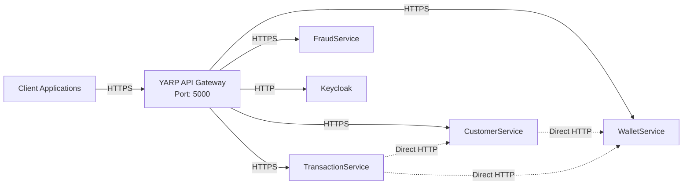

# Security

This document provides comprehensive information about security and identity management in the Wallet Framework. It covers authentication, authorization, service-to-service communication, secret management, and API Gateway security.

## Table of Contents

1. [Authentication - Keycloak Integration](#authentication---keycloak-integration)
2. [Authorization - RBAC](#authorization---rbac)
3. [Internal Authentication - Service-to-Service](#internal-authentication---service-to-service)
4. [Secret Management - HashiCorp Vault](#secret-management---hashicorp-vault)
5. [API Gateway - YARP](#api-gateway---yarp)

---

## Authentication - Keycloak Integration

### Overview

The Wallet Framework uses **Keycloak** as the identity and access management (IAM) solution. All user authentication and authorization is handled through Keycloak using OpenID Connect (OIDC) and OAuth 2.0 protocols.

### JWT Bearer Authentication

All microservices are configured to accept JWT Bearer tokens issued by Keycloak. The authentication setup is implemented in [AuthenticationExtensions.cs](src/Services/FraudService/WF.FraudService.Api/Extensions/AuthenticationExtensions.cs):

```csharp
public static IServiceCollection AddWFAuthentication(
    this IServiceCollection services,
    IConfiguration configuration,
    IWebHostEnvironment environment)
{
    // Register claims transformation for role mapping
    services.AddTransient<IClaimsTransformation, KeycloakRolesClaimsTransformation>();

    var keycloakOptions = configuration.GetSection("Keycloak").Get<KeycloakOptions>()
        ?? new KeycloakOptions
        {
            BaseUrl = "http://localhost:8080",
            Realm = "wallet-realm"
        };

    var authority = $"{keycloakOptions.BaseUrl}/realms/{keycloakOptions.Realm}";

    services.AddAuthentication(options =>
    {
        options.DefaultAuthenticateScheme = JwtBearerDefaults.AuthenticationScheme;
        options.DefaultChallengeScheme = JwtBearerDefaults.AuthenticationScheme;
    })
    .AddJwtBearer(options =>
    {
        options.Authority = authority;
        options.RequireHttpsMetadata = environment.IsProduction();
        options.TokenValidationParameters = new TokenValidationParameters
        {
            ValidateAudience = environment.IsProduction(),
            ValidateIssuer = true,
            ValidIssuer = authority
        };
    });

    return services;
}
```

**Key Configuration Points:**
- **Authority**: `http://localhost:8080/realms/wallet-realm` (development)
- **Token Validation**: Issuer validation is always enabled; audience validation only in production
- **HTTPS Metadata**: Required only in production environments
- **Default Scheme**: JWT Bearer for all authentication

### JWT Token Structure

Keycloak issues JWT tokens with the following structure:

#### Header
```json
{
  "alg": "RS256",
  "typ": "JWT",
  "kid": "..."
}
```

#### Payload (Claims)
```json
{
  "sub": "user-uuid",
  "azp": "wallet-client",
  "realm_access": {
    "roles": ["wf-admin", "wf-customer"]
  },
  "resource_access": {
    "wallet-client": {
      "roles": ["service_account"]
    }
  },
  "scope": "openid profile email",
  "exp": 1234567890,
  "iat": 1234567890,
  "iss": "http://localhost:8080/realms/wallet-realm"
}
```

**Important Claims:**
- `sub`: Subject (user ID)
- `azp`: Authorized party (client ID that requested the token)
- `realm_access.roles`: Realm-level roles (e.g., `wf-admin`, `wf-customer`)
- `exp`: Token expiration timestamp
- `iss`: Token issuer (Keycloak realm)

### Claims Transformation

Keycloak roles are stored in the `realm_access.roles` claim as a JSON object. The [KeycloakRolesClaimsTransformation](src/Services/FraudService/WF.FraudService.Api/Authentication/KeycloakRolesClaimsTransformation.cs) extracts these roles and maps them to standard ASP.NET Core `ClaimTypes.Role`:

```csharp
public class KeycloakRolesClaimsTransformation : IClaimsTransformation
{
    public Task<ClaimsPrincipal> TransformAsync(ClaimsPrincipal principal)
    {
        var claimsIdentity = principal.Identity as ClaimsIdentity;
        if (claimsIdentity == null || !claimsIdentity.IsAuthenticated)
        {
            return Task.FromResult(principal);
        }

        // Skip if roles already transformed
        if (claimsIdentity.HasClaim(c => c.Type == ClaimTypes.Role && c.Value.StartsWith("wf-")))
        {
            return Task.FromResult(principal);
        }

        // Extract roles from realm_access claim
        var realmAccessClaim = claimsIdentity.FindFirst("realm_access");
        if (realmAccessClaim != null && !string.IsNullOrWhiteSpace(realmAccessClaim.Value))
        {
            using var document = JsonDocument.Parse(realmAccessClaim.Value);
            var root = document.RootElement;

            if (root.TryGetProperty("roles", out var rolesElement) && rolesElement.ValueKind == JsonValueKind.Array)
            {
                foreach (var roleElement in rolesElement.EnumerateArray())
                {
                    var role = roleElement.GetString();
                    // Only add roles prefixed with "wf-"
                    if (!string.IsNullOrWhiteSpace(role) && role.StartsWith("wf-", StringComparison.OrdinalIgnoreCase))
                    {
                        claimsIdentity.AddClaim(new Claim(ClaimTypes.Role, role));
                    }
                }
            }
        }

        return Task.FromResult(principal);
    }
}
```

**Key Points:**
- Only roles prefixed with `wf-` are extracted (project-specific roles)
- Roles are added as standard `ClaimTypes.Role` claims
- Transformation is idempotent (won't duplicate roles)

### Obtaining Access Tokens

#### For End Users (Resource Owner Password Credentials)

```bash
curl -X POST "http://localhost:8080/realms/wallet-realm/protocol/openid-connect/token" \
  -H "Content-Type: application/x-www-form-urlencoded" \
  -d "grant_type=password" \
  -d "client_id=wallet-client" \
  -d "client_secret=<CLIENT_SECRET>" \
  -d "username=<USERNAME>" \
  -d "password=<PASSWORD>"
```

#### For Service Accounts (Client Credentials)

See [Internal Authentication](#internal-authentication---service-to-service) section.

---

## Authorization - RBAC

### Role-Based Access Control (RBAC)

The system uses Role-Based Access Control (RBAC) where users are assigned roles that grant specific permissions. Roles are defined in Keycloak and mapped to authorization policies in the application.

### Role Definitions

Roles are defined in [KeycloakRoles.cs](shared/WF.Shared.Contracts/Enums/KeycloakRoles.cs):

| Role Enum | Keycloak Role Name | Description | Use Case |
|-----------|-------------------|-------------|----------|
| `Admin` | `wf-admin` | Full system access | System administrators, super users |
| `Customer` | `wf-customer` | End user access | Regular customers using the wallet |
| `Officer` | `wf-officer` | Compliance/Operations | Compliance officers, operations staff |
| `Support` | `wf-support` | Customer support | Support team members |

**Role Naming Convention:**
- All application roles are prefixed with `wf-` to distinguish them from Keycloak system roles
- Roles are defined at the realm level in Keycloak
- Users can have multiple roles assigned

### Authorization Policies

Authorization policies are defined in the `AddWFAuthentication` extension method:

```csharp
services.AddAuthorization(options =>
{
    // Service-to-service communication
    options.AddPolicy("ServiceToService", policy =>
    {
        policy.RequireAuthenticatedUser();
        policy.RequireClaim("azp", "wallet-client", "fraud-client");
    });

    // Admin-only access
    options.AddPolicy("Admin", policy =>
        policy.RequireRole(KeycloakRoles.Admin.GetRoleName()));

    // Customer access
    options.AddPolicy("Customer", policy =>
        policy.RequireRole(KeycloakRoles.Customer.GetRoleName()));

    // Officer access (includes Admin)
    options.AddPolicy("Officer", policy =>
        policy.RequireRole(
            KeycloakRoles.Admin.GetRoleName(), 
            KeycloakRoles.Officer.GetRoleName()));

    // Support access (includes Admin and Officer)
    options.AddPolicy("Support", policy =>
        policy.RequireRole(
            KeycloakRoles.Admin.GetRoleName(), 
            KeycloakRoles.Officer.GetRoleName(), 
            KeycloakRoles.Support.GetRoleName()));
});
```

| Policy | Requirements | Use Case |
|--------|--------------|----------|
| `ServiceToService` | Authenticated + `azp` claim = `wallet-client` or `fraud-client` | Internal service-to-service API calls |
| `Admin` | Role: `wf-admin` | Admin endpoints, full system access |
| `Customer` | Role: `wf-customer` | Customer-facing endpoints |
| `Officer` | Role: `wf-admin` OR `wf-officer` | Compliance and operations endpoints |
| `Support` | Role: `wf-admin` OR `wf-officer` OR `wf-support` | Customer support endpoints |

### Endpoint Authorization Examples

#### Public Endpoint (No Authentication)

```csharp
[ApiVersion("1.0")]
[Route("api/v{version:apiVersion}/customers")]
public class CustomersController : BaseController
{
    [HttpPost]
    [AllowAnonymous]  // Public registration endpoint
    public async Task<IActionResult> Register([FromBody] CreateCustomerCommand command)
    {
        // Registration logic
    }
}
```

#### Authenticated Endpoint (Any Authenticated User)

```csharp
[ApiVersion("1.0")]
[Route("api/v{version:apiVersion}/customers")]
[Authorize]  // Requires authentication, any role
public class CustomersController : BaseController
{
    [HttpGet("{id}")]
    public async Task<IActionResult> GetCustomer(Guid id)
    {
        // Customer can only access their own data
        // Additional authorization logic in handler
    }
}
```

#### Admin-Only Endpoint

```csharp
[ApiVersion("1.0")]
[Route("api/v{version:apiVersion}/admin/customers")]
[Authorize(Policy = "Admin")]  // Requires wf-admin role
public class AdminCustomersController : BaseController
{
    [HttpGet]
    public async Task<IActionResult> GetAllCustomers()
    {
        // Admin-only operation
    }
}
```

#### Internal Service Endpoint

```csharp
[ApiVersion("1.0")]
[Route("api/v{version:apiVersion}/internal/customers")]
[Authorize(Policy = "ServiceToService")]  // Requires service client credentials
[ApiExplorerSettings(IgnoreApi = true)]  // Hidden from Swagger
public class CustomerInternalController : BaseController
{
    [HttpGet("by-identity/{identityId}")]
    public async Task<IActionResult> GetCustomerByIdentity(string identityId)
    {
        // Internal service-to-service call
    }
}
```

**Key Characteristics of Internal Endpoints:**
- Protected by `ServiceToService` policy
- Hidden from Swagger UI (`IgnoreApi = true`)
- Only accessible via direct service-to-service calls (not through Gateway)
- Use Client Credentials Flow for authentication

---

## Internal Authentication - Service-to-Service

### Overview

Services communicate with each other using **Client Credentials Flow** (OAuth 2.0). This flow is designed for machine-to-machine communication where no user context is required.

### Client Credentials Flow

The Client Credentials Flow implementation is in [KeycloakTokenService.cs](src/Services/TransactionService/WF.TransactionService.Infrastructure/Authentication/KeycloakTokenService.cs):

```csharp
public class KeycloakTokenService : IKeycloakTokenService
{
    public async Task<TokenResult> GetTokenAsync(CancellationToken cancellationToken = default)
    {
        using var httpClient = httpClientFactory.CreateClient("Keycloak");
        
        var tokenEndpoint = $"{options.Value.BaseUrl}/realms/{options.Value.Realm}/protocol/openid-connect/token";

        var requestBody = new Dictionary<string, string>
        {
            { "grant_type", "client_credentials" },
            { "client_id", options.Value.ClientId },
            { "client_secret", options.Value.ClientSecret }
        };

        var request = new HttpRequestMessage(HttpMethod.Post, tokenEndpoint)
        {
            Content = new FormUrlEncodedContent(requestBody)
        };

        var response = await httpClient.SendAsync(request, cancellationToken);
        response.EnsureSuccessStatusCode();

        var tokenResponse = await response.Content.ReadFromJsonAsync<TokenResponse>(JsonOptions, cancellationToken);
        
        return new TokenResult
        {
            AccessToken = tokenResponse.AccessToken,
            ExpiresIn = tokenResponse.ExpiresIn
        };
    }
}
```

**Flow Steps:**
1. Service requests token from Keycloak using `client_id` and `client_secret`
2. Keycloak validates credentials and issues access token
3. Service uses token in `Authorization: Bearer <token>` header
4. Target service validates token against Keycloak

### Token Caching

To avoid excessive calls to Keycloak, tokens are cached in Redis using [TokenCacheService.cs](src/Services/TransactionService/WF.TransactionService.Infrastructure/Authentication/TokenCacheService.cs):

```csharp
public class TokenCacheService : ITokenCacheService
{
    private const string CacheKey = "service_auth_token";
    private const int RefreshBufferSeconds = 60;  // Refresh 60 seconds before expiry
    private readonly SemaphoreSlim _semaphore = new(1, 1);

    public async Task<string> GetTokenAsync(CancellationToken cancellationToken = default)
    {
        // Check cache first
        var cachedToken = await GetCachedTokenAsync(cancellationToken);
        if (cachedToken != null && !IsTokenExpiringSoon(cachedToken))
        {
            return cachedToken.Token;
        }

        // Thread-safe token refresh
        await _semaphore.WaitAsync(cancellationToken);
        try
        {
            // Double-check after acquiring lock
            cachedToken = await GetCachedTokenAsync(cancellationToken);
            if (cachedToken != null && !IsTokenExpiringSoon(cachedToken))
            {
                return cachedToken.Token;
            }

            // Refresh token from Keycloak
            var tokenResult = await keycloakTokenService.GetTokenAsync(cancellationToken);
            
            // Cache with expiry
            var cacheExpirySeconds = Math.Max(tokenResult.ExpiresIn - RefreshBufferSeconds, 30);
            var cacheOptions = new DistributedCacheEntryOptions
            {
                AbsoluteExpirationRelativeToNow = TimeSpan.FromSeconds(cacheExpirySeconds)
            };

            await distributedCache.SetStringAsync(
                CacheKey,
                JsonSerializer.Serialize(new CachedToken { Token = tokenResult.AccessToken, ... }),
                cacheOptions,
                cancellationToken);

            return tokenResult.AccessToken;
        }
        finally
        {
            _semaphore.Release();
        }
    }
}
```

**Key Features:**
- **Distributed Cache**: Redis for multi-instance scenarios
- **Automatic Refresh**: Tokens refreshed 60 seconds before expiry
- **Thread-Safe**: SemaphoreSlim prevents concurrent refresh requests
- **Double-Check Pattern**: Prevents race conditions

### DelegatingHandler Pattern

The `DelegatingHandler` pattern automatically adds authentication tokens to outgoing HTTP requests. Implementation in [ServiceAuthenticationHandler.cs](src/Services/TransactionService/WF.TransactionService.Infrastructure/Authentication/ServiceAuthenticationHandler.cs):

```csharp
public class ServiceAuthenticationHandler : DelegatingHandler
{
    protected override async Task<HttpResponseMessage> SendAsync(
        HttpRequestMessage request,
        CancellationToken cancellationToken)
    {
        try
        {
            var token = await tokenCacheService.GetTokenAsync(cancellationToken);
            
            if (!string.IsNullOrWhiteSpace(token))
            {
                request.Headers.Authorization = new AuthenticationHeaderValue("Bearer", token);
                logger.LogDebug("Service authentication token added to outgoing request {RequestUri}", request.RequestUri);
            }
            else
            {
                logger.LogWarning("No service authentication token available for request {RequestUri}", request.RequestUri);
            }
        }
        catch (Exception ex)
        {
            logger.LogError(ex, "Failed to add service authentication token to request {RequestUri}", request.RequestUri);
        }

        return await base.SendAsync(request, cancellationToken);
    }
}
```

### Registration

HTTP clients are configured with the authentication handler:

```csharp
// In DependencyInjectionExtensions.cs
services.AddHttpClient<ICustomerServiceApiClient, CustomerServiceApiClient>()
    .AddHttpMessageHandler<ServiceAuthenticationHandler>();

services.AddHttpClient<IWalletServiceApiClient, WalletServiceApiClient>()
    .AddHttpMessageHandler<ServiceAuthenticationHandler>();
```

**Benefits:**
- Automatic token injection for all requests
- Transparent to application code
- Centralized token management
- Handles token refresh automatically

---

## Secret Management - HashiCorp Vault

### Overview

The Wallet Framework uses **HashiCorp Vault** for secure secret management. Secrets are stored centrally and loaded into application configuration at runtime.

### Vault Integration

Vault integration is implemented in [ConfigurationExtensions.cs](src/Services/TransactionService/WF.TransactionService.Api/Extensions/ConfigurationExtensions.cs):

```csharp
public static void AddVaultConfiguration(
    this IConfigurationBuilder configurationBuilder, 
    IConfiguration configuration)
{
    var vaultOptions = configuration.GetSection("Vault");
    var enabled = vaultOptions.GetValue<bool>("Enabled");

    if (!enabled)
    {
        return;  // Skip Vault in development if disabled
    }

    var address = vaultOptions.GetValue<string>("Address");
    var token = vaultOptions.GetValue<string>("Token");

    if (string.IsNullOrEmpty(address) || string.IsNullOrEmpty(token))
    {
        return;
    }

    // Add shared secrets
    configurationBuilder.AddVaultConfiguration(
        () => new VaultOptions(address, token, reloadOnChange: true, reloadCheckIntervalSeconds: 600),
        "wallet/shared",
        "secret"
    );

    // Add service-specific secrets
    var assemblyName = Assembly.GetEntryAssembly()?.GetName().Name;
    string? serviceName = null;
    if (assemblyName != null)
    {
        var parts = assemblyName.Split('.');
        if (parts.Length > 1)
        {
            serviceName = parts[1].ToLower();  // e.g., "customerservice"
        }
    }

    if (!string.IsNullOrEmpty(serviceName))
    {
        configurationBuilder.AddVaultConfiguration(
            () => new VaultOptions(address, token, reloadOnChange: true, reloadCheckIntervalSeconds: 600),
            $"wallet/{serviceName}",
            "secret"
        );
    }
}
```

### Secret Path Structure

Secrets are organized hierarchically in Vault:

```
secret/
└── wallet/
    ├── shared/                    # Shared across all services
    │   ├── Keycloak__ClientSecret
    │   └── Database__ConnectionString
    │
    ├── customerservice/           # CustomerService-specific
    │   
    │
    ├── walletservice/            # WalletService-specific
    │   
    │
    └── transactionservice/       # TransactionService-specific
    │   
    │
    └── fraudservice/             # FraudService-specific
        
```

### Configuration by Environment

| Environment | Secret Storage | Vault Token | Notes |
|-------------|---------------|-------------|-------|
| **Development** | `appsettings.Development.json` + Vault (optional) | `my-root-token` | Vault can be disabled for local dev |
| **Production** | Vault only | Proper authentication (AppRole, Kubernetes, etc.) | No secrets in config files |

### Development Setup

For local development, Vault runs in dev mode:

```yaml
# docker-compose.yml
vault:
  image: hashicorp/vault:latest
  ports:
    - "8200:8200"
  environment:
    VAULT_DEV_ROOT_TOKEN_ID: "my-root-token"
    VAULT_ADDR: "http://127.0.0.1:8200"
  command: server -dev
```

**Access Vault UI:**
- URL: http://localhost:8200
- Token: `my-root-token` (dev mode only)

### Secrets Stored in Vault

Common secrets stored in Vault:

| Secret Path | Example Key | Purpose |
|-------------|-------------|---------|
| `wallet/shared` | `Keycloak__ClientSecret` | Keycloak client secret for all services |
| `wallet/shared` | `Database__ConnectionString` | Shared database credentials |
| `wallet/{service}` | `ExternalApi__Key` | Service-specific API keys |
| `wallet/{service}` | `EncryptionKey` | Service-specific encryption keys |

### Auto-Reload Configuration

Vault configuration supports auto-reload:
- **Reload Interval**: 600 seconds (10 minutes)
- **Reload on Change**: Enabled (Vault notifies on secret updates)
- **Zero-Downtime**: Configuration updates don't require service restart

---

## API Gateway - YARP

### Overview

The **YARP (Yet Another Reverse Proxy)** API Gateway serves as the single entry point for all external traffic. It provides routing, rate limiting, CORS, and request forwarding to backend services.

### Architecture



**Key Points:**
- External clients → Gateway → Services
- Services communicate directly (bypass Gateway)
- Gateway handles authentication, rate limiting, CORS

### Route Configuration

Routes are configured in [appsettings.Development.json](src/Infrastructure/WF.ApiGateway/appsettings.Development.json):

#### Public Routes

| Route Name | Path Pattern | Target Service | Transform | Purpose |
|------------|--------------|----------------|-----------|---------|
| `customer-public-route` | `/api/v{version}/customers/{**remainder}` | CustomerService | Path rewrite | Customer endpoints |
| `wallet-route` | `/api/v{version}/wallets/{**remainder}` | WalletService | Path rewrite | Wallet operations |
| `transaction-route` | `/api/v{version}/transactions/{**remainder}` | TransactionService | Path rewrite | Transaction endpoints |
| `fraud-route` | `/api/v{version}/frauds/{**remainder}` | FraudService | Path rewrite | Fraud check endpoints |

#### Admin Routes

| Route Name | Path Pattern | Target Service | Purpose |
|------------|--------------|----------------|---------|
| `customer-admin-route` | `/api/v{version}/admin/customers/{**remainder}` | CustomerService | Admin customer management |
| `wallet-admin-route` | `/api/v{version}/admin/wallets/{**remainder}` | WalletService | Admin wallet operations |
| `transaction-admin-route` | `/api/v{version}/admin/transactions/{**remainder}` | TransactionService | Admin transaction management |
| `fraud-admin-route` | `/api/v{version}/admin/fraud/{**remainder}` | FraudService | Fraud rule management |

#### Authentication Routes

| Route Name | Path Pattern | Target Service | Transform | Purpose |
|------------|--------------|----------------|-----------|---------|
| `auth-register-route` | `/api/v{version}/auth/register` | CustomerService | `/api/v{version}/customers` | User registration |
| `auth-login-route` | `/api/v{version}/auth/login` | Keycloak | `/realms/wallet-realm/protocol/openid-connect/token` | Token endpoint |
| `identity-route` | `/realms/{**remainder}` | Keycloak | Path preserved | Keycloak endpoints |

### Internal Endpoints (NOT Routed via Gateway)

Internal endpoints are **not** exposed through the Gateway. They are accessed directly by services:

| Service | Internal Path | Authorization | Swagger |
|---------|--------------|---------------|---------|
| CustomerService | `/api/v{version}/internal/customers/*` | `ServiceToService` policy | Hidden |
| WalletService | `/api/v{version}/internal/wallets/*` | `ServiceToService` policy | Hidden |
| TransactionService | `/api/v{version}/internal/transactions/*` | `ServiceToService` policy | Hidden |

**Example from [CustomerInternalController.cs](src/Services/CustomerService/WF.CustomerService.Api/Controllers/Internal/CustomerInternalController.cs):**

```csharp
[ApiVersion("1.0")]
[Route("api/v{version:apiVersion}/internal/customers")]
[Authorize(Policy = "ServiceToService")]  // Only service clients
[ApiExplorerSettings(IgnoreApi = true)]   // Hidden from Swagger
public class CustomerInternalController : BaseController
{
    [HttpGet("by-identity/{identityId}")]
    public async Task<IActionResult> GetCustomerByIdentity(string identityId)
    {
        // Internal service-to-service call
    }
}
```

**Why Internal Endpoints Exist:**
- Direct service-to-service communication (lower latency)
- No Gateway overhead for internal calls
- Different security model (Client Credentials vs User tokens)
- Not exposed to external clients

### Rate Limiting

The Gateway implements IP-based rate limiting:

```json
"IpRateLimiting": {
    "EnableEndpointRateLimiting": true,
    "StackBlockedRequests": false,
    "RealIpHeader": "X-Real-IP",
    "HttpStatusCode": 429,
    "GeneralRules": [
        {
            "Endpoint": "*",
            "Period": "1m",
            "Limit": 60
        },
        {
            "Endpoint": "*:/api/v*/auth/*",
            "Period": "1m",
            "Limit": 10
        }
    ]
}
```

**Rate Limits:**
- **General**: 60 requests per minute per IP
- **Auth endpoints**: 10 requests per minute per IP (prevents brute force)

### CORS Configuration

CORS is configured for development:

```csharp
if (builder.Environment.IsDevelopment())
{
    options.AddPolicy("AllowAll", policy =>
    {
        policy.AllowAnyOrigin()
              .AllowAnyMethod()
              .AllowAnyHeader();
    });
}
```

**Production:** CORS should be configured with specific origins, methods, and headers.

### Gateway Security Features

1. **Single Entry Point**: All external traffic flows through Gateway
2. **Rate Limiting**: Prevents abuse and DDoS attacks
3. **Request Forwarding**: Transparent proxying to backend services
4. **Path Transformation**: URL rewriting for service routing
5. **Health Check Forwarding**: Gateway can forward health checks

---

## Security Best Practices

### Development

1. **Use Vault for Secrets**: Store sensitive data in Vault, not in config files
2. **Regenerate Client Secrets**: Always regenerate Keycloak client secrets after import
3. **HTTPS in Production**: Always use HTTPS in production environments
4. **Validate Tokens**: Ensure token validation is enabled (issuer, audience)

### Production

1. **Vault Authentication**: Use proper Vault authentication (AppRole, Kubernetes, etc.)
2. **Keycloak HTTPS**: Configure Keycloak with proper SSL certificates
3. **Token Expiry**: Use appropriate token expiry times (default: 5 minutes)
4. **Audience Validation**: Enable audience validation in production
5. **CORS Restrictions**: Configure CORS with specific allowed origins
6. **Rate Limiting**: Tune rate limits based on expected traffic
7. **Monitoring**: Monitor authentication failures and suspicious activity

---

## Additional Resources

- [Getting Started Guide](getting-started.md) - Keycloak setup and configuration
- [Architecture Documentation](architecture.md) - System design overview
- [Keycloak Documentation](https://www.keycloak.org/documentation)
- [HashiCorp Vault Documentation](https://www.vaultproject.io/docs)
- [YARP Documentation](https://microsoft.github.io/reverse-proxy/)
